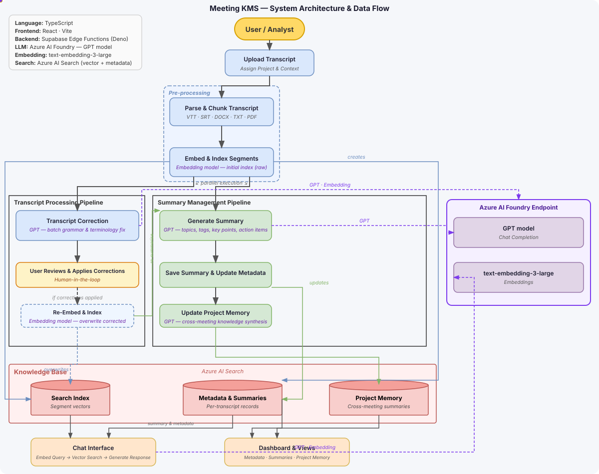

# Meeting KMS

**AI-powered meeting transcription, correction, summarization, and retrieval — built for enterprise knowledge management.**

**🚀 Live demo: [haoran-yang-henry.github.io/Meeting_KMS_Original](https://haoran-yang-henry.github.io/Meeting_KMS_Original/)** — sign up with any email and try it.

https://github.com/haoran-yang-henry/Meeting_KMS_Original/assets/245156046/568974182-530154bb-6bb3-4b9a-8299-cd5682ebe469

---


## Overview

Meeting KMS transforms raw meeting transcripts into structured organizational knowledge. Upload a transcript, let AI correct domain-specific errors using your project's context, generate hierarchical summaries, and retrieve insights through semantic search or agentic chat.

```
Upload → Parse → Correct → Summarize → Search
```

### System Architecture



---

## Features

### Transcript Ingestion
- Supports VTT, SRT, DOCX, PDF, XLSX, TXT, JSON, MD (up to 50MB)
- Semantic chunking: 600+ raw cues → 80–120 context-rich chunks
- Automatic speaker merging, punctuation-aware splitting
- Duplicate detection via title matching

### AI-Powered Correction
- Context-aware correction using project memory from past meetings
- Categorized suggestions: domain terms, misspellings, abbreviations, redactions
- Review and apply/reject suggestions with live preview
- Custom glossary and redaction rules

### Hierarchical Summarization
- **Meeting level** — per-transcript summary with tags, decisions, action items
- **Project level** — auto-aggregated cross-meeting memory
- Manual editing and one-click regeneration
- Cascade updates: saving a summary refreshes the full project memory

### Retrieval & Agentic Chat
- 4-tool AI agent per transcript:
  - `search_transcript` — RAG over indexed segments
  - `search_summary` — query meeting summaries
  - `adjust_summary` — regenerate with a focus topic
  - `extract_from_transcript` — pull quotes, names, dates
- Global cross-transcript semantic search with conversation history
- Dashboard views: Timeline, Project, Group, Topic, Unassigned

---

## Tech Stack

| Layer | Technology |
|---|---|
| Frontend | React 18, TypeScript, Vite, Tailwind CSS, shadcn/ui |
| Backend | Supabase Edge Functions (Deno) |
| AI Models | OpenAI API (chat + embeddings via text-embedding-3-large) |
| Search & Storage | Supabase Postgres + pgvector (hybrid vector + keyword, RLS) |
| i18n | i18next — English & German |

---

## Getting Started

### Prerequisites
- Node.js 18+
- A Supabase project (Postgres + pgvector for storage & search, Auth for login)
- An OpenAI API key

### Installation

```bash
git clone https://github.com/your-username/meeting-kms.git
cd meeting-kms
npm install
```

### Environment Variables

Create a `.env` file:

```env
VITE_SUPABASE_URL=https://<your-project>.supabase.co
VITE_SUPABASE_PROJECT_ID=<your-project-id>
VITE_SUPABASE_PUBLISHABLE_KEY=<your-anon-key>
```

Apply the database schema: run `supabase/migrations/20260708000000_initial_schema.sql` in the Supabase SQL Editor (or `supabase db push`).

Set the following secrets in your **Supabase project dashboard** (Edge Functions → Secrets):

```
OPENAI_API_KEY           # required
MS_CLIENT_ID             # optional, required for Microsoft Teams import
MS_CLIENT_SECRET         # optional, required for Microsoft Teams import

OPENAI_CHAT_MODEL        # optional, default: gpt-5.2-chat
OPENAI_MINI_MODEL        # optional, default: gpt-5-nano
OPENAI_EMBEDDING_MODEL   # optional, default: text-embedding-3-large
ALLOWED_ORIGIN           # optional: lock CORS to your deployed frontend origin
```

For Microsoft Teams import, create a Microsoft Entra app registration and add this web redirect URI:

```text
https://<your-project>.supabase.co/functions/v1/teams-callback
```

Then set the Edge Function secrets:

```bash
supabase secrets set MS_CLIENT_ID="<entra-application-client-id>" MS_CLIENT_SECRET="<entra-client-secret>"
```

The Teams transcript flow requests delegated Microsoft Graph permissions for `User.Read`, `Calendars.Read`, `OnlineMeetings.Read`, `OnlineMeetingTranscript.Read.All`, and `offline_access`. `OnlineMeetingTranscript.Read.All` often requires tenant admin consent.

### Run

```bash
npm run dev       # Development server at http://localhost:8080
npm run build     # Production build
npm run preview   # Preview production build
```

---

## Architecture

```
Browser (React)
    │
    ├── Upload / Correction / Summary  →  Index Page
    ├── Semantic Search + Chat         →  Search Page
    └── Multi-view Dashboard           →  Dashboard Page
    │
    ▼
Supabase Edge Functions (Deno)
    │
    ├── transcripts-add-to-index            →  Embed + upsert to Azure AI Search
    ├── transcripts-check                   →  Correction suggestions via GPT
    ├── transcripts-generate-summary        →  Meeting summary via GPT
    ├── transcripts-generate-project-summary  →  Aggregate project memory
    ├── transcripts-chat                    →  4-tool agentic router
    └── transcripts-search                  →  Hybrid vector + keyword search
    │
    ▼
Azure AI Search  ←→  Azure OpenAI (GPT + Embeddings)
```

All persistent data lives in **Azure AI Search** as two document types:
- `segment` — chunked transcript text with 3072-dim embeddings
- `metadata` — meeting metadata, summaries, tags, and project memory

---

## Data Models

```typescript
interface TranscriptSegment {
  segmentId: string;
  transcriptId: string;
  text: string;
  speaker?: string;
  startTime?: string;
  endTime?: string;
}

interface TranscriptMetadata {
  meetingTitle?: string;
  meetingDate?: string;
  project?: string;
  group?: string;
  topic?: string;
  summaryText?: string;       // Markdown
  summaryTags?: string[];
  projectSummary?: string;    // Aggregated cross-meeting memory
}
```

---

## Project Structure

```
src/
├── pages/           # Auth, Index, Search, Dashboard
├── components/      # Correction, chat, summary, dashboard views
├── contexts/        # Auth session provider
├── hooks/           # Business logic (workflow, correction, summary, search)
├── lib/             # Transcript parser, utilities
├── types/           # TypeScript interfaces
└── i18n/            # en / de locale files

supabase/
├── functions/       # Edge functions (per-endpoint folders)
│   └── _shared/     # Auth wrapper, CORS, embeddings, parser
└── migrations/      # Postgres schema (tables, RLS, hybrid_search)

docu/                # Architecture diagram and sequence flows (tracked)
docs/                # Local working files: drawio sources, HTML, video (git-ignored)
```

---

## Documentation

Detailed architecture and sequence diagrams are in [`/docu`](./docu/):

- [`architecture.md`](./docu/architecture.md) — System overview with Mermaid diagram
- [`functional_modules.md`](./docu/functional_modules.md) — In-depth module breakdown
- Sequence diagrams for each pipeline stage:
  [ingestion](./docu/seq_transcript_capture_and_ingestion.md) ·
  [correction](./docu/seq_context_integration_and_transcript_correction.md) ·
  [summarization](./docu/seq_personalized_and_hierarchical_summary_generation.md) ·
  [retrieval](./docu/seq_retrieval_multiview_navigation_and_visualization.md)

---

## License

MIT
