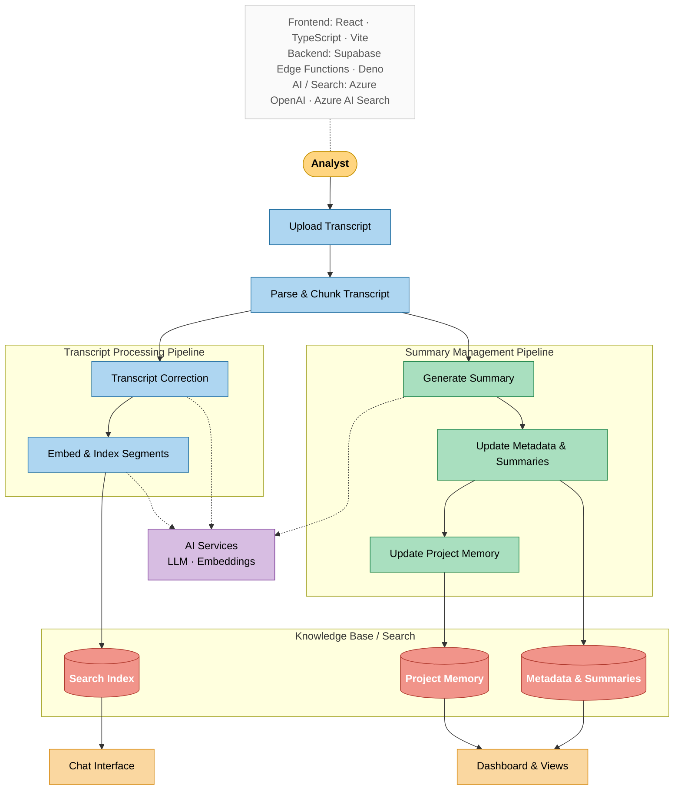

# Meeting KMS — System Architecture

---

## Repository Understanding

**User entry and input:**
Users begin in `Index.tsx` by uploading a meeting file (VTT, SRT, DOCX, PDF, TXT, JSON). The full workflow is orchestrated by `useTranscriptWorkflow`. Project/group/topic metadata is attached at this stage.

**Transcript Processing Pipeline:**
File is parsed and semantically chunked client-side (`transcript-parser.ts`: 600+ raw cues → 80–120 semantic segments). Segments are immediately embedded and indexed into Azure AI Search (`transcripts-add-to-index`). Transcript Correction (`transcripts-check`) runs in parallel with Summary Generation — confirmed by `Promise.all([checkBatchPromises, transcripts-generate-summary])` at lines 521–524 of `useTranscriptWorkflow.ts`. Corrections can trigger a re-index of the corrected segments.

**Summary Management Pipeline:**
`transcripts-generate-summary` runs in parallel with Transcript Correction. Its output is persisted with full meeting metadata via `transcripts-save-summary` (Metadata & Summaries). This then cascades into `transcripts-generate-project-summary`, which aggregates all meeting summaries for the project and writes a unified project context field (Project Memory). This cascade fires after every save event.

**Supporting components:**
All LLM and embedding calls are server-side inside Supabase Edge Functions. Azure OpenAI GPT is used by Transcript Correction, Summary Generation, and Retrieval. The embedding model is used during Embed & Index and inside Retrieval for query encoding. The persistent store is Azure AI Search (no relational database).

**User-facing access surfaces:**
Chat Interface (`Index.tsx` + `transcripts-chat`): an agentic edge function that routes to one of four tools — search transcript, search summary, adjust summary, extract. `Search.tsx` uses the same function with cross-transcript RAG enabled. Dashboard (`Dashboard.tsx` + `useTranscriptFilter` → `transcripts-search`): read-only, no AI generation triggered from the dashboard.

**Important files inspected:**
`useTranscriptWorkflow.ts` (lines 414, 521–524, 560, 586), `transcript-parser.ts`, `Index.tsx`, `Dashboard.tsx`, `Search.tsx`, `useTranscriptFilter.ts`, `transcripts-chat/index.ts`, `transcripts-generate-summary/index.ts`, `transcripts-check/index.ts`, `transcripts-generate-project-summary/index.ts`

**Assumptions / uncertainties:**
Parse & Chunk is placed as a shared entry node outside both pipeline subgraphs because it feeds both pipelines in parallel. `transcripts-generate-organization-summary` exists in the repo but is not invoked from any active frontend workflow and is excluded.

---

## System Architecture Diagram

> **Arrow legend:** Solid arrows show primary data and control flow. Dashed arrows show AI service dependency (LLM / embedding calls made server-side within each module).
