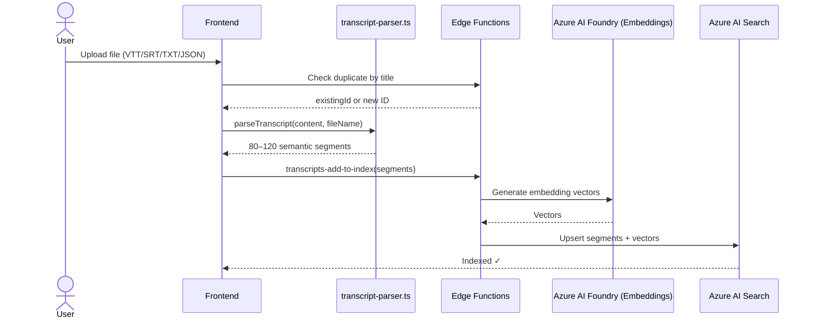
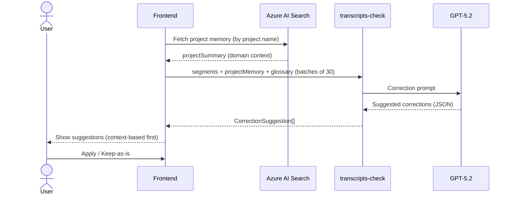
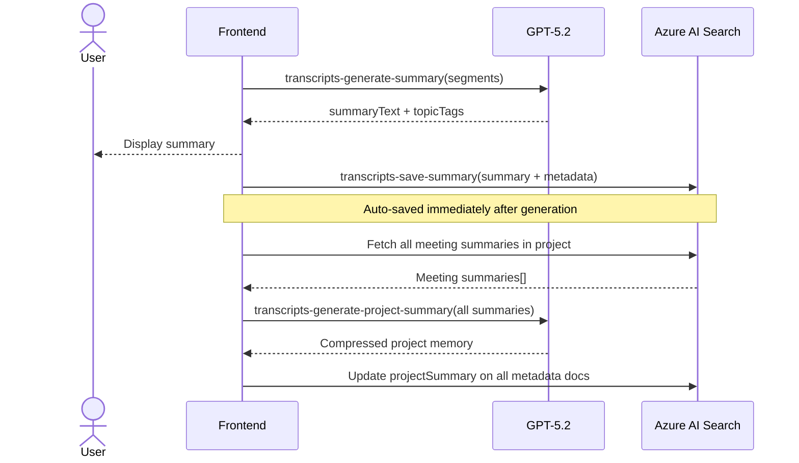
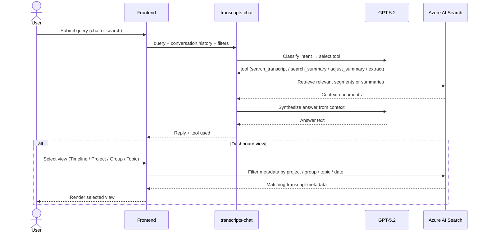

# Meeting KMS — Functional Module Documentation

This document describes the four core functional modules of the Meeting KMS system, their responsibilities, key components, and interaction flows.

---

## Module Overview

| Module | Primary Responsibility |
|--------|----------------------|
| Transcript Capture and Ingestion | Accept raw meeting files, parse and semantically chunk them, immediately index into the knowledge base |
| Context Integration and Transcript Correction | Retrieve project memory, detect transcription errors, and propose AI-driven correction suggestions |
| Personalized and Hierarchical Summary Generation | Generate per-meeting summaries and aggregate them into multi-level project memory |
| Retrieval, Multi-view Navigation, and Visualization | Enable semantic search, agentic chat, and multi-dimensional dashboard views |

---

## Transcript Capture and Ingestion

### Responsibility

Accepts uploaded meeting files in any supported format (VTT, SRT, DOCX, PDF, TXT, JSON), classifies the file type, parses the raw content into structured segments via semantic chunking, and immediately indexes the raw segments into Azure AI Search so they are searchable from the moment of upload.

### Key Components

| Component | File | Role |
|-----------|------|------|
| Upload entry point | `src/pages/Index.tsx` | Receives file drop / selection from user |
| Workflow orchestrator | `src/hooks/useTranscriptWorkflow.ts` | Drives the full upload → parse → index pipeline |
| Parser & chunker | `src/lib/transcript-parser.ts` | Classifies file type; parses VTT/SRT/JSON/plain-text; applies semantic merging to produce 80–120 chunks from 600+ raw cues |
| Index edge function | `supabase/functions/transcripts-add-to-index/index.ts` | Embeds segments via Azure AI Foundry and upserts them into Azure AI Search |
| Duplicate checker | `supabase/functions/transcripts-find-by-title/index.ts` | Detects re-uploads of the same meeting by title to support update semantics |

### Semantic Chunking Strategy

The parser applies an **aggressive semantic merge** pass after initial timestamp-based extraction:

- Merges segments from the same speaker within a 10-second gap
- Respects sentence-ending punctuation as a split signal
- Enforces a minimum chunk size of 200 characters and a maximum of 1500 characters
- Result: 80–120 meaningful semantic chunks per meeting, optimized for embedding quality

### Sequence Diagram



---

## Context Integration and Transcript Correction

### Responsibility

After ingestion, the system fetches existing project memory from the knowledge base to provide domain-aware context, then runs an AI-powered correction pass over all transcript segments in parallel batches. Corrections are categorized as context-based (domain terms, glossary, omit rules) or general (misspellings, abbreviations, ambiguity). The user reviews and applies or rejects each suggestion.

### Key Components

| Component | File | Role |
|-----------|------|------|
| Workflow orchestrator | `src/hooks/useTranscriptWorkflow.ts` | Fetches project memory; dispatches batched check calls; aggregates and sorts suggestions |
| Correction edge function | `supabase/functions/transcripts-check/index.ts` | Builds prompt with glossary + project memory + context; calls Azure AI Foundry GPT-5.2; parses JSON suggestions; repairs truncated JSON |
| Correction UI | `src/components/CorrectionSuggestions.tsx` | Renders suggestions grouped by priority; exposes Apply / Keep-as-is actions |
| Apply logic | `useTranscriptWorkflow.applySuggestion()` | Performs in-place substring replacement within the segment; updates `correctedSegments` map |
| Re-check hook | `useTranscriptWorkflow.recheckWithContext()` | Allows user to supply additional context (glossary / redaction rules) and re-run the correction pass |

### Correction Priority Model

| Priority | Trigger | Examples |
|----------|---------|---------|
| `context` | Project memory, glossary, or omit rules matched | Domain term wrong, content to redact |
| `general` | Baseline transcript quality | Misspelling, unexpanded abbreviation |

Context-based suggestions are always sorted first; within each tier, sorted by confidence descending.

### Sequence Diagram



---

## Personalized and Hierarchical Summary Generation

### Responsibility

Generates a structured summary for each meeting using Azure AI Foundry GPT-5.2, including decisions, action items, and topic tags. The summary is auto-saved immediately after generation. If the transcript belongs to a project, the system waits for the Azure Search index to settle, then regenerates the project-level memory by aggregating all meeting summaries in the project. This creates a two-tier hierarchy: individual meeting summaries and cross-meeting project memory.

### Summary Hierarchy

```
Organization
└── Project (cross-meeting aggregated memory)
    └── Meeting Summary (per-transcript: decisions, actions, topic tags)
        └── Raw Segments (indexed in Azure AI Search)
```

### Key Components

| Component | File | Role |
|-----------|------|------|
| Workflow orchestrator | `src/hooks/useTranscriptWorkflow.ts` | Calls `generateSummary()`, auto-saves, triggers project memory update |
| Summary edge function | `supabase/functions/transcripts-generate-summary/index.ts` | Fetches indexed segments from Azure Search; calls GPT-5.2 with structured prompt; returns `summaryText` + `topicTags` |
| Save edge function | `supabase/functions/transcripts-save-summary/index.ts` | Persists summary + keywords + project/topic metadata to Azure AI Search metadata document |
| Project memory function | `supabase/functions/transcripts-generate-project-summary/index.ts` | Aggregates all meeting summaries in a project → GPT-5.2 → compressed project memory stored in each metadata document |
| Organization summary | `supabase/functions/transcripts-generate-organization-summary/index.ts` | Cross-project roll-up (top-level hierarchy) |
| Summary UI | `src/components/AISummary.tsx` | Renders markdown summary; provides Edit and Regenerate actions |
| Dashboard components | `src/components/dashboard/LayeredAgentSummary.tsx`, `HierarchicalSummaryLayers.tsx` | Renders multi-level summary breakdown across meetings |

### Sequence Diagram



---

## Retrieval, Multi-view Navigation, and Visualization

### Responsibility

Provides all end-user access surfaces over the indexed knowledge base: semantic search across all transcripts, an agentic 4-tool chat interface that routes queries to the most appropriate retrieval strategy, and a multi-dimensional dashboard offering timeline, project, group, and topic views of meeting data.

### Key Components

| Component | File | Role |
|-----------|------|------|
| Search page | `src/pages/Search.tsx` | Cross-transcript RAG search with chat history |
| Dashboard page | `src/pages/Dashboard.tsx` | Multi-view (timeline / project / group / topic) navigation |
| Single-transcript chat | `src/components/TranscriptChat.tsx` | In-context chat on the Index page |
| Search edge function | `supabase/functions/transcripts-search/index.ts` | Hybrid vector + keyword search via Azure AI Search; applies project/group/date filters |
| Chat edge function | `supabase/functions/transcripts-chat/index.ts` | 4-tool agentic routing: classifies intent → selects tool → executes → synthesizes response |
| Filter hook | `src/hooks/useTranscriptFilter.ts` | Fetches and filters transcript metadata for Dashboard views |
| Timeline component | `src/components/dashboard/TopicMapTimeline.tsx` | Visualizes topics across meetings on a timeline |
| Hierarchical view | `src/components/dashboard/HierarchicalSummaryLayers.tsx` | Multi-level summary breakdown |

### Agentic Chat — 4-Tool Routing

The `transcripts-chat` edge function uses a two-step agentic design:

| Tool | Trigger | Action |
|------|---------|--------|
| `search_transcript` | Factual questions about transcript content | Vector + keyword search over segment index |
| `search_summary` | Questions about decisions or action items | Retrieve from summary metadata document |
| `adjust_summary` | Requests to rewrite or restructure summary | Generate new summary using full transcript |
| `extract_from_transcript` | Requests for structured extraction (e.g., speaker list) | Direct extraction from raw content |

### Sequence Diagram



---

## Cross-Module Data Flow

```
┌─────────────────────────────────────────────────────────────────────┐
│                       Capture & Ingestion                            │
│  File Upload → classify → parse → semantic chunk → index (raw)      │
└───────────────────────────────┬─────────────────────────────────────┘
                                 │ segments + transcriptId
          ┌──────────────────────┴──────────────────────┐
          ▼                                              ▼
┌─────────────────────┐                    ┌────────────────────────────┐
│  Context + Correct  │                    │   Summary Generation       │
│                     │                    │                            │
│                     │                    │                            │
│ Fetch project memory│                    │ Generate meeting summary   │
│ Run AI correction   │                    │ Auto-save summary          │
│ User reviews/applies│                    │ Update project memory      │
└──────────┬──────────┘                    └────────────┬───────────────┘
           │ corrected segments                          │ summaries + project memory
           ▼                                             ▼
┌─────────────────────────────────────────────────────────────────────┐
│                 Azure AI Search (Knowledge Base)                     │
│  docType=segment  │  docType=metadata (summary + projectSummary)    │
└───────────────────────────────┬─────────────────────────────────────┘
                                 │
┌───────────────────────────────▼─────────────────────────────────────┐
│              Retrieval, Navigation & Visualization                   │
│  Agentic chat (4-tool routing) │ Semantic search │ Dashboard views  │
└─────────────────────────────────────────────────────────────────────┘
```
