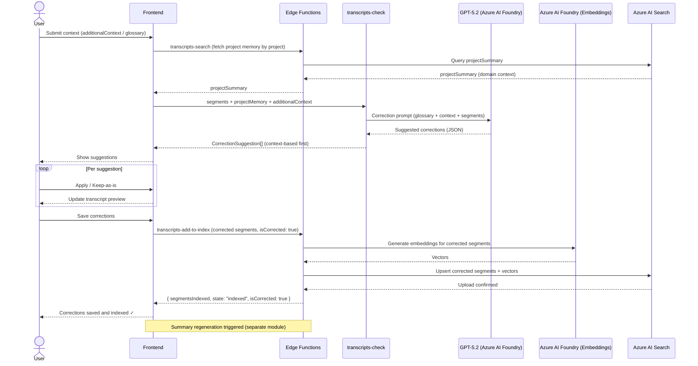

```mermaid
sequenceDiagram
    actor User
    participant Frontend as Frontend
    participant Backend as Edge Functions
    participant Check as transcripts-check
    participant GPT as GPT-5.2 (Azure AI Foundry)
    participant EmbedModel as Azure AI Foundry (Embeddings)
    participant AzureSearch as Azure AI Search

    User->>Frontend: Submit context (additionalContext / glossary)
    Frontend->>Backend: transcripts-search (fetch project memory by project)
    Backend->>AzureSearch: Query projectSummary
    AzureSearch-->>Backend: projectSummary (domain context)
    Backend-->>Frontend: projectSummary

    Frontend->>Check: segments + projectMemory + additionalContext
    Check->>GPT: Correction prompt (glossary + context + segments)
    GPT-->>Check: Suggested corrections (JSON)
    Check-->>Frontend: CorrectionSuggestion[] (context-based first)
    Frontend-->>User: Show suggestions

    loop Per suggestion
        User->>Frontend: Apply / Keep-as-is
        Frontend-->>User: Update transcript preview
    end

    User->>Frontend: Save corrections
    Frontend->>Backend: transcripts-add-to-index (corrected segments, isCorrected: true)
    Backend->>EmbedModel: Generate embeddings for corrected segments
    EmbedModel-->>Backend: Vectors
    Backend->>AzureSearch: Upsert corrected segments + vectors
    AzureSearch-->>Backend: Upload confirmed
    Backend-->>Frontend: { segmentsIndexed, state: "indexed", isCorrected: true }
    Frontend-->>User: Corrections saved and indexed ✓

    Note over Frontend,Backend: Summary regeneration triggered (separate module)
```