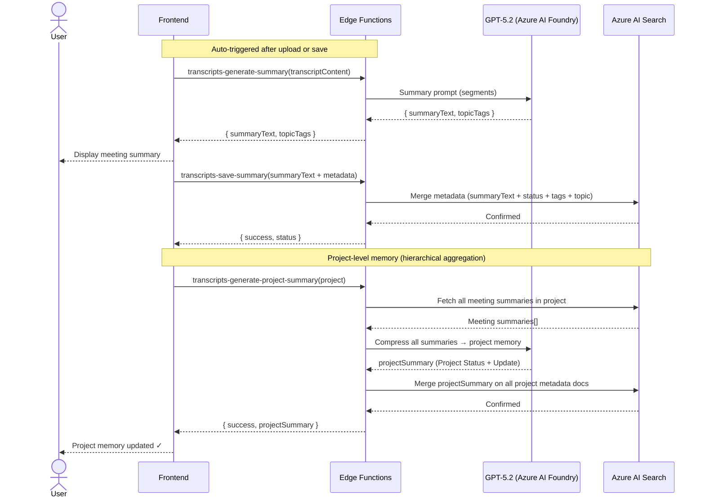

```mermaid
sequenceDiagram
    actor User
    participant Frontend as Frontend
    participant Backend as Edge Functions
    participant GPT52 as GPT-5.2 (Azure AI Foundry)
    participant AzureSearch as Azure AI Search

    Note over Frontend,Backend: Auto-triggered after upload or save

    Frontend->>Backend: transcripts-generate-summary(transcriptContent)
    Backend->>GPT52: Summary prompt (segments)
    GPT52-->>Backend: { summaryText, topicTags }
    Backend-->>Frontend: { summaryText, topicTags }
    Frontend-->>User: Display meeting summary

    Frontend->>Backend: transcripts-save-summary(summaryText + metadata)
    Backend->>AzureSearch: Merge metadata (summaryText + status + tags + topic)
    AzureSearch-->>Backend: Confirmed
    Backend-->>Frontend: { success, status }

    Note over Frontend,AzureSearch: Project-level memory (hierarchical aggregation)
    Frontend->>Backend: transcripts-generate-project-summary(project)
    Backend->>AzureSearch: Fetch all meeting summaries in project
    AzureSearch-->>Backend: Meeting summaries[]
    Backend->>GPT52: Compress all summaries → project memory
    GPT52-->>Backend: projectSummary (Project Status + Update)
    Backend->>AzureSearch: Merge projectSummary on all project metadata docs
    AzureSearch-->>Backend: Confirmed
    Backend-->>Frontend: { success, projectSummary }
    Frontend-->>User: Project memory updated ✓
```