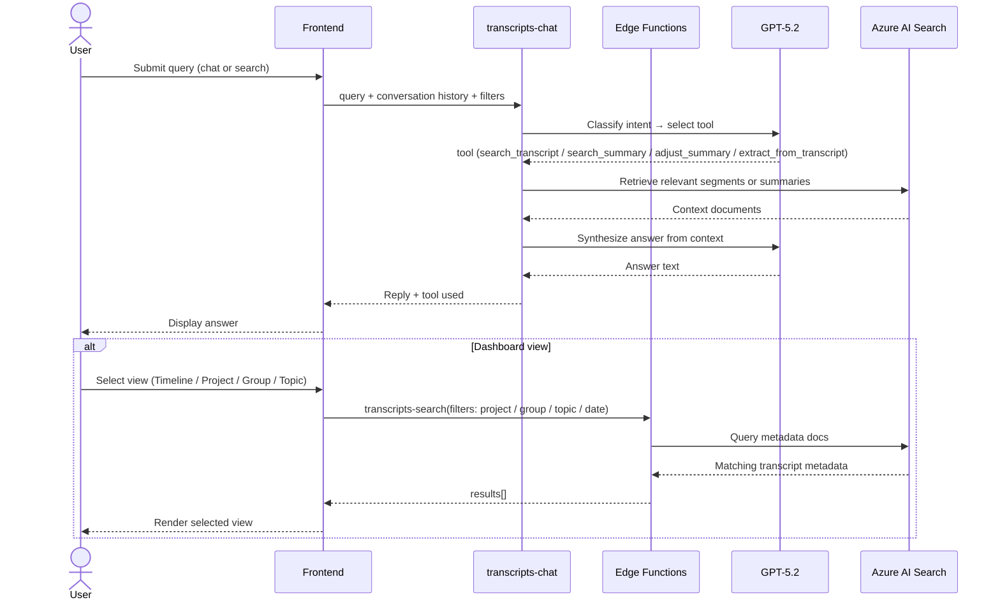

```mermaid
sequenceDiagram
    actor User
    participant Frontend as Frontend
    participant ChatFn as transcripts-chat
    participant Backend as Edge Functions
    participant GPT as GPT-5.2
    participant AzureSearch as Azure AI Search

    User->>Frontend: Submit query (chat or search)
    Frontend->>ChatFn: query + conversation history + filters

    ChatFn->>GPT: Classify intent → select tool
    GPT-->>ChatFn: tool (search_transcript / search_summary / adjust_summary / extract_from_transcript)

    ChatFn->>AzureSearch: Retrieve relevant segments or summaries
    AzureSearch-->>ChatFn: Context documents

    ChatFn->>GPT: Synthesize answer from context
    GPT-->>ChatFn: Answer text
    ChatFn-->>Frontend: Reply + tool used
    Frontend-->>User: Display answer

    alt Dashboard view
        User->>Frontend: Select view (Timeline / Project / Group / Topic)
        Frontend->>Backend: transcripts-search(filters: project / group / topic / date)
        Backend->>AzureSearch: Query metadata docs
        AzureSearch-->>Backend: Matching transcript metadata
        Backend-->>Frontend: results[]
        Frontend-->>User: Render selected view
    end
```
