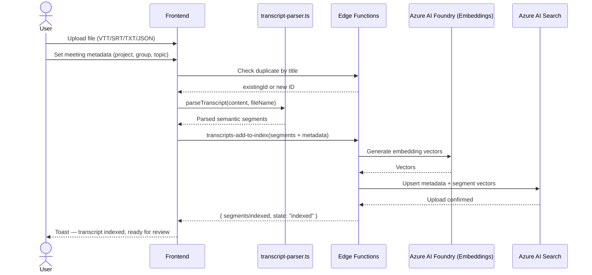

```mermaid
sequenceDiagram
    actor User
    participant Frontend as Frontend
    participant Parser as transcript-parser.ts
    participant Backend as Edge Functions
    participant EmbedModel as Azure AI Foundry (Embeddings)
    participant AzureSearch as Azure AI Search

    User->>Frontend: Upload file (VTT/SRT/TXT/JSON)
    User->>Frontend: Set meeting metadata (project, group, topic)
    Frontend->>Backend: Check duplicate by title
    Backend-->>Frontend: existingId or new ID
    Frontend->>Parser: parseTranscript(content, fileName)
    Parser-->>Frontend: Parsed semantic segments
    Frontend->>Backend: transcripts-add-to-index(segments + metadata)
    Backend->>EmbedModel: Generate embedding vectors
    EmbedModel-->>Backend: Vectors
    Backend->>AzureSearch: Upsert metadata + segment vectors
    AzureSearch-->>Backend: Upload confirmed
    Backend-->>Frontend: { segmentsIndexed, state: "indexed" }
    Frontend-->>User: Toast — transcript indexed, ready for review
```